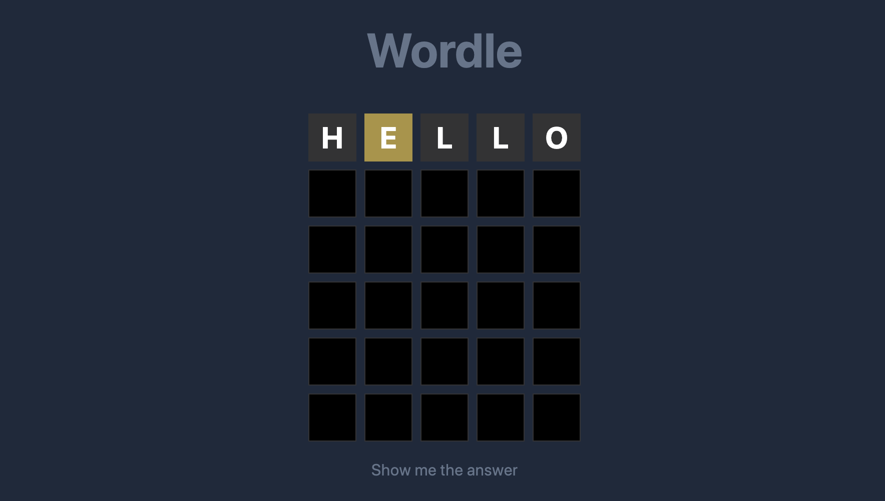

# Wordle

[Wordle](https://wordle-4e7f5.web.app/) is a clone for the famous word-puzzling game.

## About Wordle

- The main goal of the game is to guess the five-letter word in six attempts.
- Built the user interface for quick development with **Tailwind**.
- Ensured the code maintainability by implementing **Typescript**.

## Built with

     

## Screenshot

### Contact

- [LinkedIn](https://www.linkedin.com/in/pei-pei-hsueh-1a8a4a7a/)
- [Email](mailto:peipei.hsueh@outlook.com)
